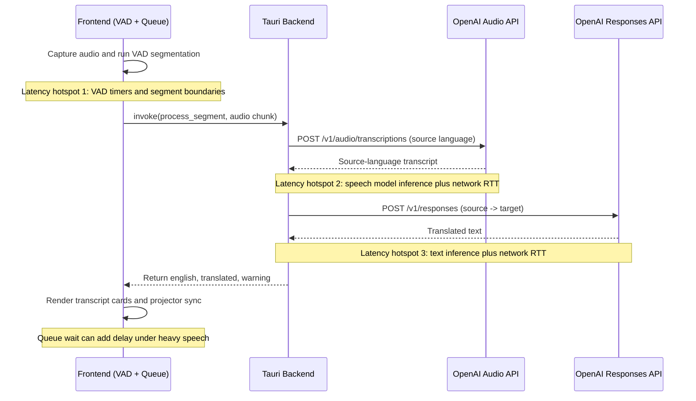

# Translation Pipeline

Use this for architecture, API behavior, and latency troubleshooting.

## Developer Setup

### Requirements

- Node.js 20+
- Rust stable toolchain
- OpenAI API key

### Run locally

```bash
npm install
npm run start
```

### Verify frontend types

```bash
npm run typecheck
```

## Project Structure

- `src/`: frontend UI (HTML/CSS/TypeScript), audio capture, VAD, queue, caption rendering.
- `src-tauri/`: Rust backend (Tauri commands, API calls, storage, packaging).
- `AGENTS.md`: repository-level agent guidance.

## Sequence And Latency

If your markdown viewer cannot render Mermaid, use the text fallback right below.



Text fallback:

1. Frontend captures audio and segments with VAD.
2. Frontend sends `process_segment` chunk to backend.
3. Backend calls `/v1/audio/transcriptions` and gets source-language text.
4. Backend calls `/v1/responses` for source -> target translation.
5. Backend returns `{ english, translated, warning }`.
6. Frontend renders panels and syncs projector output.

## Normal Korean -> Chinese Call Pattern (2 APIs)

1. `/v1/audio/transcriptions` (`whisper-1`, `language=ko`) for Korean speech -> Korean text
2. `/v1/responses` (`gpt-4o-mini`) for Korean -> Chinese

## Where Latency Is Usually Spent

1. Segmentation wait (frontend): chunk waits for silence hold or max segment boundary.
2. Audio API inference + network: often dominant for noisy or long chunks.
3. Source-to-target text inference + network.
4. Queue backlog: sequential queue reduces burst failures but can add wait.

## Prompt Priming Notes

- STT prompt priming means sending context hints (rolling context + keywords + script hints) to improve recognition quality.
- Stable STT keywords and sermon-specific STT keywords help API 1 (speech recognition).
- Source-language context is tracked separately from English context so non-English STT stays anchored in the original language.
- Glossary helps API 2 (translation wording consistency), including Korean -> target-language church terms.

## Quality Guards

- Non-English STT uses `response_format=verbose_json` and checks segment confidence metadata before translation.
- Segments are skipped when confidence signals are weak (language mismatch, high no-speech ratio, low log-probability concentration, or repetition signatures).
- Basic anti-hallucination cleanup removes assistant-style meta replies and repeated duplicate lines before text translation.
- Korean -> Chinese includes built-in secondary consistency checks (Korean anchor terms and no-place polarity against Chinese output) and emits warnings when mismatches are detected.
- These secondary rules are built-in defaults and do not require user-provided rule configuration.

## Deep Reference Notes

- Shared bottom status bar shows run state, translation state, translation-mode state, queue size.
- Hotkey pills are clickable and state-aware (Start/Stop, Suspend/Resume, and more).
- Settings page separates advanced controls from live captions.
- Translation Mode uses sticky live control bar + compact hotkey map.
- Script panel supports independent scrolling in Translation Mode.
- Segment queue is sequential with retries to reduce burst failures.
- Auto-save writes transcript files to `~/Desktop/ChurchTranslateSessions` when enabled.
